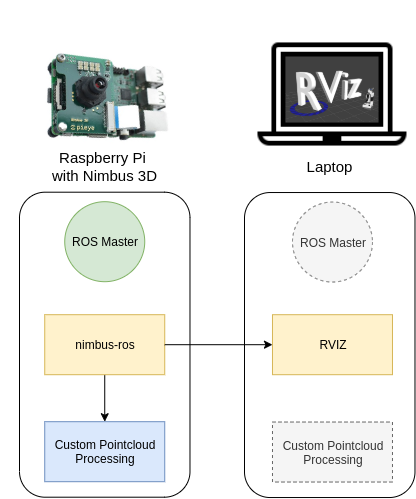

============
Installation
============

Raspberry Pi
============
Nimbus 3D is a time-of-flight camera for the Raspberry Pi that captures high-resolution 3D point clouds.
The Raspberry Pi4 is recommended for the best experience.
Prepared Raspberry OS images are available.
If these are used, the following installation can be skipped.

nimbus-userland
===============
The official Raspberry OS kernel includes an implementation for the Nimbus 3D. 
To use it, the corresponding embedded sources must be installed.

1. Update to bleeding edge kernel

.. code-block:: shell

    sudo rpi-update

2. Add the Nimbus 3D apt repository
.. code-block:: shell

    echo 'deb http://apt.pieye.org/debian/ nimbus-stable main' | sudo tee -a /etc/apt/sources.list

    wget -O - -q http://apt.pieye.org/apt.pieye.org.gpg.key | sudo apt-key add -

    sudo apt update

3. Add the Imager to your boot config
.. code-block:: shell

    sudo echo 'dtoverlay=irs1125' | sudo tee -a /boot/config.txt

4. Install the nimbus-server or libnimbus-dev
.. code-block:: shell

    sudo apt-get install nimbus-server
    
    sudo apt-get install libnimbus-dev

4. Reboot the Raspberry Pi
.. code-block:: shell

    sudo reboot now

nimbus-web
==========
Nimbus-web is the webinterface for the Nimbus 3D. 
There it is possible to see in real time the point cloud, depth images and intensity images. 
Furthermore it is possible to adjust the exposure and read the log.
The source code is available here: `Github <https://github.com/pieye/nimbus-web>`_.

1. Install nginx and git
.. code-block:: shell

    sudo apt-get install nginx git

2. Clone the code
.. code-block:: shell

    git clone https://github.com/pieye/nimbus-web.git

3. Edit file /etc/nginx/sites-available/default (with sudo) and change line 41 from
.. code-block:: shell

    root /var/www/html;

to
.. code-block:: shell

    root /home/pi/nimbus-web;

4. Restart nginx
.. code-block:: shell

    sudo service nginx restart

5. Open a browser with the IP address of your Raspberry Pi and you should see the webinterface.

nimbus-python
=============
Nimbus-Python is the Python interface for the Nimbus 3D. 
Here it is possible to get the 3D data in Python within the local network.
The source code is available `here <https://github.com/pieye/nimbus-python>`_, but the package can also be installed directly via `pip <https://pypi.org/project/nimbus-python>`_.

.. code-block:: shell

    pip install nimbus-python

nimbus-ros
==========
The Nimbus 3D can also provide data directly in ROS (Robot Operating System), which requires the installation of nimbus-ros.
It is strongly recommended to use the finished image, because the process is quite time-consuming.

To use the low level c interface it is necessary to stop the nimbus-server. 
Check with the following command if it is running and stop it. 
For the next use of nimbus-python or nimbus-web the nimbus-server must be activated again.
.. code-block:: shell

    sudo systemctl status nimbusServer.service
    sudo systemctl stop nimbusServer.service

1. Clone `this <https://github.com/pieye/nimbus-ros>`_ Repository in the src folder of your ROS workspace.
.. code-block:: shell

    mkdir -p ~/catkin_ws/src
    cd ~/catkin_ws/src
    git clone https://github.com/pieye/nimbus-ros.git

2. To perform the following installation 4GB memory is required. 
If this is not available, the swap size must be increased accordingly:
.. code-block:: shell

    sudo dphys-swapfile swapoff
    sudo nano /etc/dphys-swapfile

3. Change these lines CONF_SWAPSIZE=3000 CONF_MAXSWAP=4096
.. code-block:: shell

    dphys-swapfile setup
    sudo dphys-swapfile swapon

4. `Install ROS Melodic from Source <http://wiki.ros.org/ROSberryPi/Installing%20ROS%20Melodic%20on%20the%20Raspberry%20Pi>`_ manually OR run the following install script:
.. code-block:: shell

    ./nimbus_3d_driver/scripts/install.sh

5. Build the nimbus_3d_driver
.. code-block:: shell

    cd ~/catkin_ws
    catkin_make

6.  Configure `ROS to run accros multiple machines <http://wiki.ros.org/ROS/Tutorials/MultipleMachines>`_
The following diagram shows the possible architectures for using your Nimbus 3D. 
The ROS driver "nimbus_3d_driver" is running on the Raspberry Pi and publishes the pointcloud.
In this guide the ROS master is also running on the Pi, but it could run on any other machine in your local network.
The Pointcloud is afterwards visualized on another Computer with a Display connected e.g. Laptop. 
Your algorithms to process the captured data can run locally on your Raspberry or any other device in the local network.

We now configure ROS to run the master on the Raspberry and access the data via another machine running ROS Melodic with RVIZ installed
Add this line to the .bashrc of your other machine (laptop), after adapting the IP to your Raspberry Pi if you are using Linux. 
You also need to add the IP of your local machine (ROS_IP):
.. code-block:: shell

    nano ~/.bashrc

    export ROS_MASTER_URI=http://192.168.1.1:11311
    export ROS_IP=192.168.1.1

If you are using Windows you need to set it up as an enviroment variable:
.. code-block:: shell

    Name: ROS_MASTER_URI      Value: http://192.168.1.1:11311
    Name: ROS_IP      	  Value: 192.168.1.1

SSH into your Raspberry and run:
.. code-block:: shell

    roscore

Start RVIZ on your machine:
.. code-block:: shell

    rviz

It should start if everything works as expected.

7. Start the Nimbus ROS Driver
The given launch file starts the nimbus node and a static coordinate transform after executing it on the Raspberry.
.. code-block:: shell

    source devel/setup.bash 
    roslaunch nimbus_3d_driver nimbus.launch

It is possible to adjust the topics where the Pointcloud, Intensity Image, and Range Image are published. 
Simply set a new topic name in the launch file. 
This is necessary when using multiple Nimbus cameras in your local network at the same time.

nimbus-ros (optional)
=====================

Clock synchronization
---------------------
Each pointcloud includes the timestamp of the initial image aquisition. 
If this is needed across devices, a clock synchronization protocal such as NTP should be used. 
PTP hardware timestamping is not available on the Raspberry Pi. 
`Chrony <https://www.linuxtechi.com/sync-time-in-linux-server-using-chrony>`_ is as often used tool for that task.

Configuration
-------------
It is possible to adjust the parameters that have an impact on the amount of transmitted data.

A 1GBit/s ethernet connection to the Raspberry Pi is highly recommended. If this is given you can launch the default configuration without making any changes.
If you only have a 100MBit/s Interface you can load the given preset by changing the default.yaml to fast_ethernet.yaml in the launch file (launch/nimbus.launch). This will reduce the resolution!
If you need to reduce the bandwitdh even further (e.g. wifi) but still need a reliable point cloud, you can replace the config against the low_bandwitdh.yaml This will heavily reduce the resolution!
Furthermore it is possible to adjust the parameters to your own needs.
Depending on the given setup it might be useful to adjust the auto exposure. 
If objects are moving fast or a minimum framerate should be achieved it can help do disable hdr and set a max value for the exposure time. 
The desired exposure can also be adjusted.

Furthermore it is possible to change the following parameters during runtime:
.. code-block:: shell

    rosparam set /nimbus_3d_driver_node/XYZ_to_m                 [0.0 - 1.0]

    rosparam set /nimbus_3d_driver_node/amplitude                [0 - 3000]

    rosparam set /nimbus_3d_driver_node/downsampling             [true | false]

    rosparam set /nimbus_3d_driver_node/downsampling_voxel_size  [0.0 - 1.0]

    rosparam set /nimbus_3d_driver_node/hdr_factor               [0.0 - 1.0]

    rosparam set /nimbus_3d_driver_node/exposure_mode            [-1 (manual), 0 (default), 1 (Auto), 2 (HDR)]
    
    rosparam set /nimbus_3d_driver_node/intensity_image          [true | false]

    rosparam set /nimbus_3d_driver_node/max_exposure             [0 - 32766]

    rosparam set /nimbus_3d_driver_node/pointcloud               [true | false]

    rosparam set /nimbus_3d_driver_node/range_image              [true | false]
