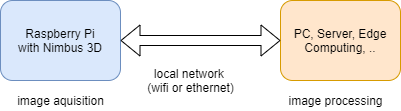

Nimbus over the network
=======================

To use nimbus over the network install the **nimbus-server** package.
`nimbus-python <https://github.com/pieye/nimbus-python>`_ use `nimbus-web <https://github.com/pieye/nimbus-web>`_ this Interface.

This way it is very easy to use the Nimbus over the network.
However, it is important that a sufficiently fast connection is available.
For the best user experience a 1GBit/s connection is recommended. 

When using nimbus-python it is recommended to use nimbus-web in parallel to see live changes.
Both are accessed via the local IP and receive the data via websockets.
See `nimbus-python <https://github.com/pieye/nimbus-python>`_ for the exact implementation of the interface.

For use in a large system, such as a robot, the use of ROS (Robot Operating System) is recommended.
This framework provides a large number of helpful tools such as visualization and data recording.
ROS also makes it possible to write code that runs both locally on the Raspberry and remotely on a PC without any changes to the program.
