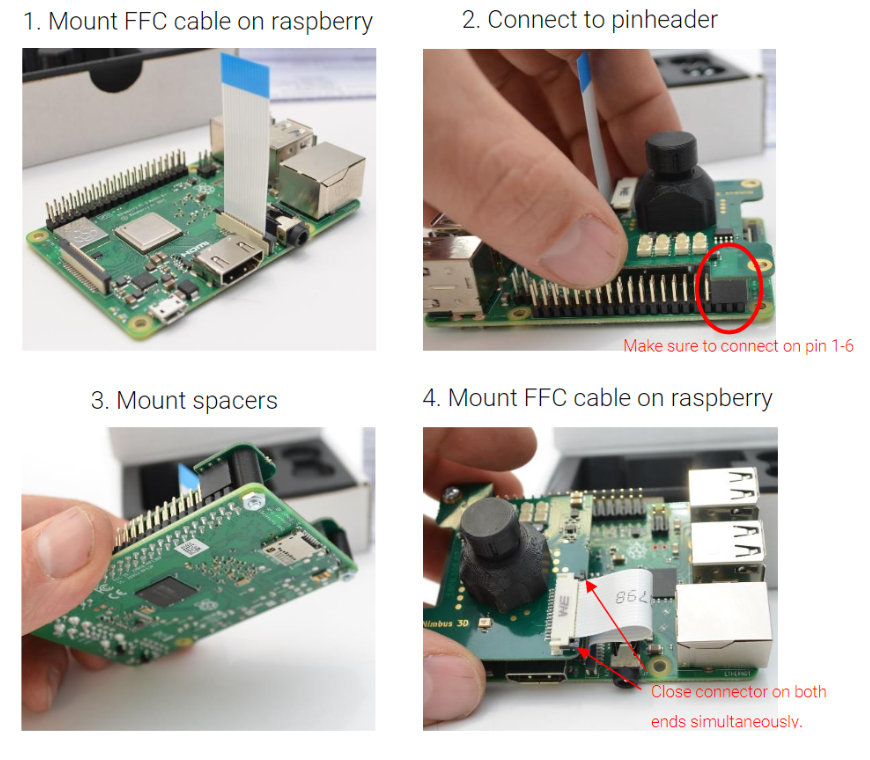
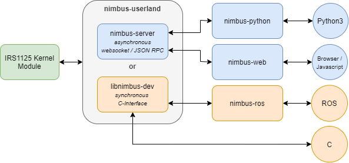
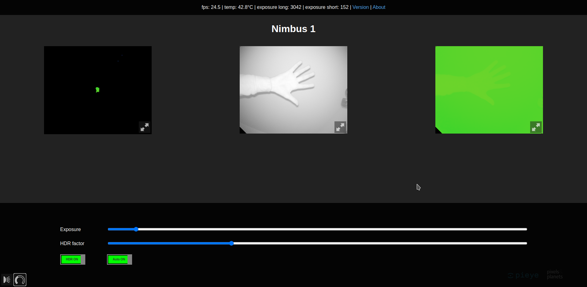
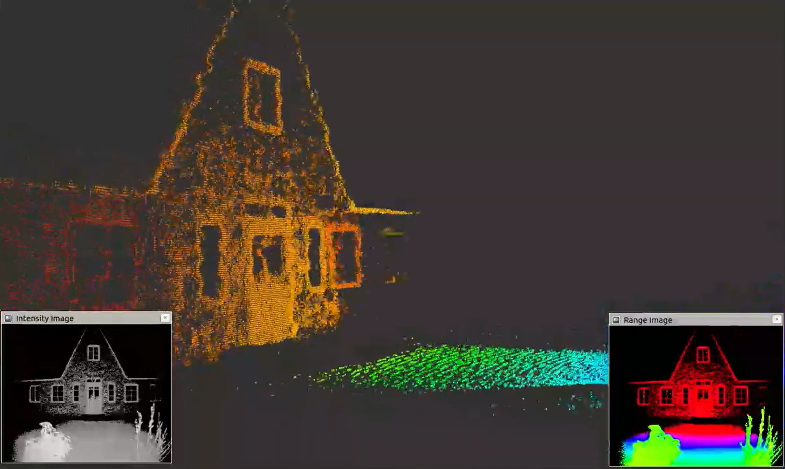

==========
Quickstart
==========

Safety instructions
-------------------
Follow the instructions for safe use provided by the raspberry pi foundation, see `qsg.pdf <https://static.raspberrypi.org/files/legacy/qsg.pdf>`_  
The camera emits strong, almost invisible IR light. 
Don't look straight into the LEDs from a short distance.

Functions and features
----------------------
Nimbus 3D is a time of flight sensor measuring the distance between the device and  the  nearest  object/surface.  
Nimbus  3D  illuminates  the  scene  with  a modulated infrared light source. 
The distance is calculated by the phase shift between the illumination unit and the reflected light.
Nimbus 3D only works with a Raspberry Pi 3B and higher, which is not part of the product.
The measured data is available via Ethernet and canbe evaluated by the user.
The  nimbus  3D  sensor  may  only  be  used  under  the  operating  conditions specified by the Raspberry Pi foundation,see `qsg.pdf <https://static.raspberrypi.org/files/legacy/qsg.pdf>`_  
Nimbus 3D is designed for indoor use only.

Items supplied
--------------

* | nimbus 3D
* | safety instructions (get a copy here https://tinyurl.com/yykf6bc4)
* | FFC jumper cable
* | 2x spacers with screws

Mounting
--------
The following images illustrate the mounting process of nimbus 3D. 
The device must be powered off, while mounting the camera.

Operation
---------
Fllow these two fundamental rules in order to get optimal performance:
* | Use a strong power supply (minimum 2.5A). The quality of onboard illumination highly depends on the supply (we recommend to use the official power supply)
* | Use a gigabit ethernet cable (cat6 and higher)

Technical data
--------------
+-----------------------+---------------------------------------+                    
| Resolution            | 352 x 288                             |
+-----------------------+---------------------------------------+                    
| Measurement range     | 0,1 - 5m                              |
+-----------------------+---------------------------------------+                    
| Viewing angle         | 66° x 54° (H x V)                     |
+-----------------------+---------------------------------------+
| Framerate             | up to 30fps                           |
+-----------------------+---------------------------------------+              
| Interface             | CSI2, I2C, 5V                         |
+-----------------------+---------------------------------------+
| Output                | amplitude, radial,                    |
|                       | confidence, point cloud               |
+-----------------------+---------------------------------------+
| Size                  | 44mm x 56mm x 23mm                    |
+-----------------------+---------------------------------------+
| Imager                | Infineon Real3 IRS1125A               |
+-----------------------+---------------------------------------+
| Power supply          | Min. 2.5 A                            |
+-----------------------+---------------------------------------+
| Network connection    | Gigabit ethernet cable cat6 or higher |
+-----------------------+---------------------------------------+

Compliance information
----------------------
Nimbus 3D complies with the relevant provisions of the RoHS Directive for the European Union. 
In common with all Electrical and Electronic Equipment (EEE) Nimbus 3D should not be disposed of as household waste. 
Alternative arrangements may apply in other jurisdictions.

Overview about the Nimbus Software
==================================

In general there are two ways to work with nimbus which are discussed in the following chapters:

1. Working directly on the Raspberry Pi (embedded)
2. Working on a desktop machine or edge computing hardware connected to a Raspberry Pi over the network

The following graphic shows the underlying architecture of the Nimbus software.
The imager takes the image and the Linux kernel module developed by us makes it available via Video4Linux.
Now two possibilities are available. 
Either the nimbus-server can be used, which makes the data available in the network via web sockets and lets you change parameters via JSON RPC.
`nimbus-python <https://github.com/pieye/nimbus-python>`_ and `nimbus-web <https://github.com/pieye/nimbus-web>`_ both use this interface.
In this way the data can be used asynchronously locally and in the network and a distributed system can be realized.
The Python interface is particularly suitable for easy use of the data. 
The web interface especially to get a live image and simply adjust the exposure.

Alternatively the local synchronous C-interface can be used, which allows the integration of own calculations into the processing stage.
So you have direct low-level access to the point cloud in C. The ROS (Robot Operating System) driver is based on this interface.

You can use the prepared `Raspberry Pi OS (buster) <https://cloud.pieye.org/index.php/s/XjcEaAw9keRf79S>`_ images with the already installed nimbus software.

nimbus-web
----------

After successful installation and setup of `nimbus-web <https://github.com/pieye/nimbus-web>`_ it can be accessed in the browser via the IP address of the Raspberry Pi.
On the left side the point cloud is visible, in the middle a grey value image and on the right side a depth image.
With a click on the buttons below, the exposure settings and information about the current image can be opened.

nimbus-ros
----------
Robot Operating System (ROS or ros) is robotics middleware. 
Although ROS is not an operating system, it provides services designed for a heterogeneous computer cluster such as hardware abstraction, low-level device control, implementation of commonly used functionality, message-passing between processes, and package management.
Running sets of ROS-based processes are represented in a graph architecture where processing takes place in nodes that may receive, post and multiplex sensor data, control, state, planning, actuator, and other messages. 
Despite the importance of reactivity and low latency in robot control, ROS itself is not a real-time OS.

In order to use the Nimbus in ROS you need the `nimbus-ros <https://github.com/pieye/nimbus-ros>`_ and ROS itself on your Rasperry Pi.

ROS is particularly useful for more extensive projects, such as industrial robotics and autonomous systems, as well as the use of existing algorithms.
The ROS driver provides point cloud, intensity image and depth image which can be visualized with RVIZ or RQT.

Furthermore, settings can be easily changed using the ROS parameter server.
Access and location transparency is easily achieved in the local network because ROS uses and abstracts the network interface.
